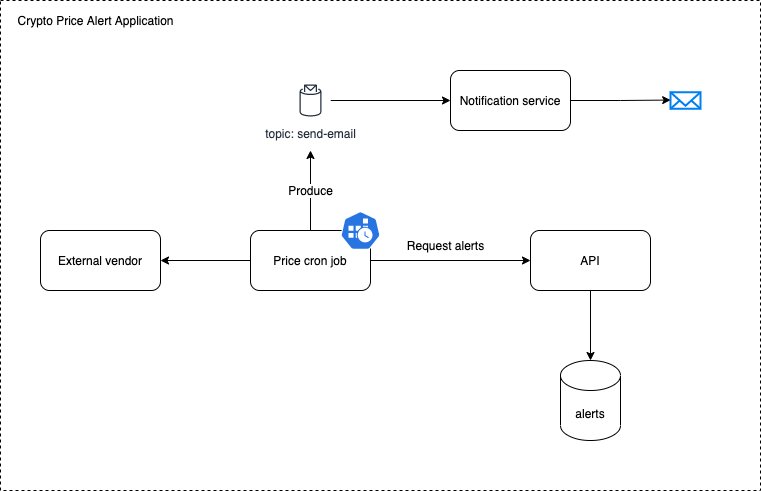

# Crypto Price Alert

Application diagram:


I opted out to overengineering this project in order to demonstrate some concepts and technologies. In order to do that, I followed some good practices, such as: Clean Architecture and SOLID principles 

# Assumptions

- One currency will be supported: USD
- Three coins will be supported: BTC, ETH, BNB
- Each job execution will notify the user about the price change

## Running

- for run application asap you can use docker-compose, as the images have already been built and uploaded to docker hub:
```shell
    make docker_compose
```

- for build the application:
```shell
    make docker_build
```

## Project's structure

```shell script
📦price-alert-service
 ┣ 📂cmd
 ┃ ┣ 📂grpc
 ┃ ┃ ┣ 📂handler
 ┃ ┃ ┣ 📂pb
 ┃ ┃ ┣ 📂proto
 ┃ ┣ 📂rest
 ┃ ┃ ┣ 📂handler
 ┃ ┃ ┣ 📂presenter
 ┃ ┃ ┗ 📜api.go
 ┃ ┗ 📜main.go
 ┣ 📂docs
 ┣ 📂internal
 ┃ ┣ 📂application
 ┃ ┣ 📂domain
 ┃ ┗ 📂infra
 ┃ ┃ ┣ 📂config
 ┃ ┃ ┣ 📂db
 ┃ ┃ ┗ 📂repository
 ┣ 📂migrations
```

```shell script
📦price-alert-job
 ┣ 📂cmd
 ┃ ┣ 📂app
 ┃ ┃ ┗ 📜app.go
 ┃ ┗ 📜main.go
 ┣ 📂internal
 ┃ ┣ 📂application
 ┃ ┣ 📂domain
 ┃ ┗ 📂infra
 ┃ ┃ ┣ 📂alert-service
 ┃ ┃ ┣ 📂config
 ┃ ┃ ┣ 📂crypto-compare
 ┃ ┃ ┣ 📂kafka
 ┃ ┃ ┗ 📂notification-broker
```

```shell script
📦notification-service
 ┣ 📂cmd
 ┃ ┣ 📂app
 ┃ ┃ ┣ 📜app.go
 ┃ ┗ 📜main.go
 ┣ 📂internal
 ┃ ┣ 📂application
 ┃ ┣ 📂domain
 ┃ ┗ 📂infra
 ┃ ┃ ┣ 📂config
 ┃ ┃ ┗ 📂gomail-email-service
```

## Code quality
- golangci-lint
- unit testing

## TODO's

- Implement DLQ (Dead Letter Queue)
- Finish graceful shutdown implementation
- Implement better api error treatment
- Implement better test coverage
- Make documentation available
- To be production ready, must follow 12-factor app, such as:
  - separate codebase (the three projects)
  - create script for database migration
  - change the price alert job to be as a one-time execution, using kubernetes job scheduler as an example